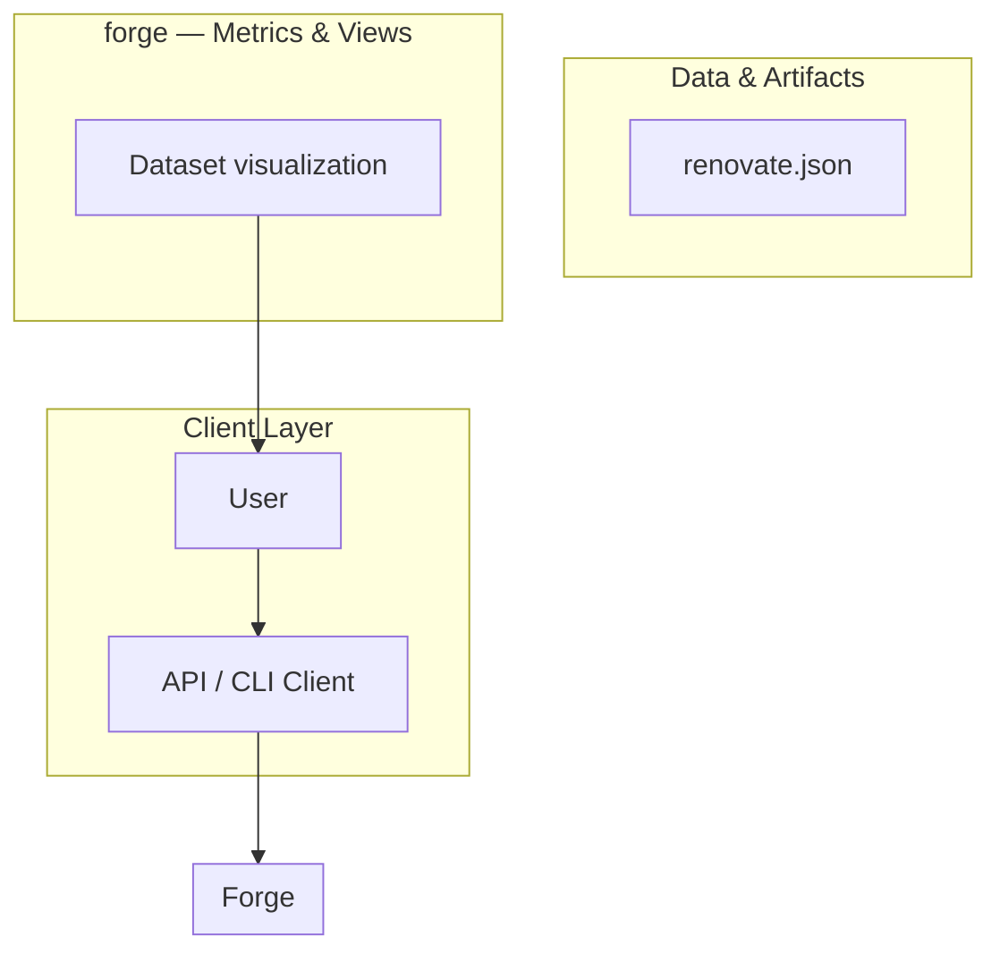
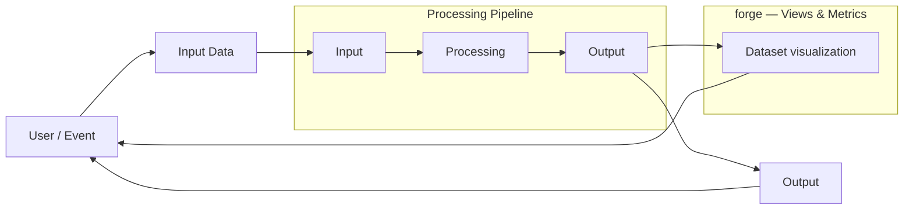
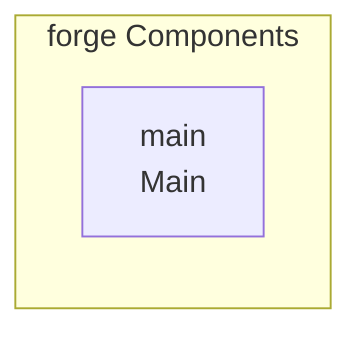

# Forge

## Key Features

- CI/CD workflows

## Technology Stack

- Rust
- Handlebars
- Shell
- CSS
- Python
- JavaScript
- cargo

# 🤖 Forge: Advanced AI Coding Agent Review and Synthesis

This document synthesizes the technical specifications for **Forge**, an advanced, context-aware AI coding agent designed to operate within the developer's terminal. Forge moves beyond simple code completion by acting as a sophisticated, multi-stage orchestrator that understands project structure, dependencies, and complex code semantics across multiple languages.

## ✨ Core Capabilities and Value Proposition

Forge's primary value lies in its ability to reduce cognitive load and accelerate the development lifecycle by providing deep, actionable context to the AI model. It is not merely a chat interface; it is an integrated development assistant.

### 🧠 Deep Code Understanding
*   **Multi-Language Parsing:** Utilizes advanced parsing techniques (like Tree-sitter) to understand the syntax and semantics of various languages (Python, JavaScript, Go, etc.) simultaneously, allowing it to reason across language boundaries.
*   **Contextual Awareness:** Maintains a comprehensive understanding of the current project state, including file system structure, installed dependencies, and the current Git branch/diff.
*   **Flow Analysis:** Can analyze complex execution flows, such as authentication mechanisms, database interactions, and API call chains, providing high-level architectural insights.

### 🛠️ Development Workflow Acceleration
*   **Scaffolding & Generation:** Capable of generating boilerplate code, entire modules, or complex shell scripts based on natural language prompts and existing project patterns.
*   **Debugging & Refactoring:** Accepts stack traces, error logs, and code diffs as input, allowing it to pinpoint root causes, suggest fixes, and propose optimized refactoring strategies.
*   **Documentation:** Can generate comprehensive documentation (docstrings, README updates) based on existing code logic.

## ⚙️ Technical Architecture Overview

Forge is designed as a modular, extensible CLI application built primarily on Python, leveraging modern web frameworks and robust parsing libraries.

### 💻 Technology Stack
*   **Primary Language:** Python (Utilizing frameworks like FastAPI for potential API exposure and Click for CLI management).
*   **Parsing:** Advanced parsing libraries (e.g., Tree-sitter) are crucial for deep, accurate code analysis across diverse languages.
*   **Orchestration:** The system operates as an AI Orchestrator, managing the flow of context data (file contents, dependency lists, terminal output) before sending it to the LLM.

### 📂 Configuration and Extensibility
*   **`forge.yaml`:** This configuration file is the central point for defining custom workflows, setting up project-specific parameters, and customizing the agent's behavior and available tools. This ensures Forge can adapt to different organizational standards and project types.
*   **CLI Interface:** The primary interaction point is a robust Command Line Interface, making it seamless for developers already working in the terminal.

## 🚀 Usage and Implementation Flow

The operational flow is highly structured, ensuring that the AI receives all necessary context before generating a response:

1.  **Input:** User provides a prompt (e.g.,

## Setup Guide

_Setup commands could not be extracted from the repository._

## System Architecture

High-level system design, data flows, API map, and workflow pipelines derived from the repository structure.

### System Architecture

### Data Flow & Charts Pipeline

### Component & API Map

