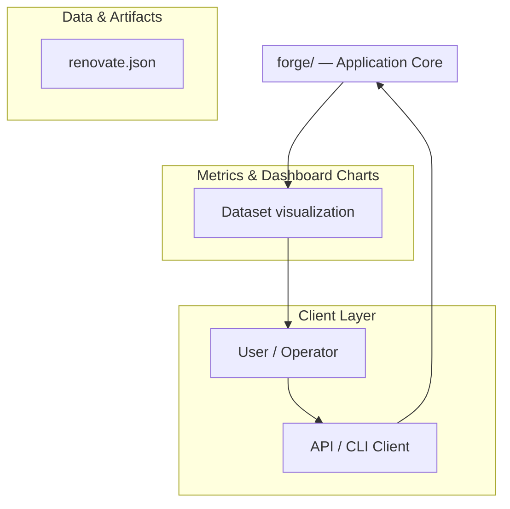
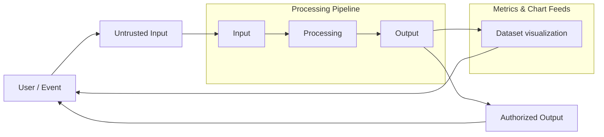
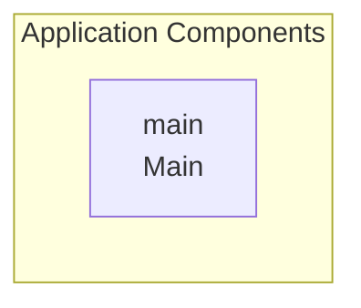

# Forge: AI-Enhanced Terminal Development Environment

A comprehensive coding agent that integrates advanced AI capabilities with the development workflow via a terminal interface.

## Overview

Forge is designed as an intelligent coding agent intended to significantly enhance the developer experience. It functions by analyzing a project's existing codebase, structure, and dependencies to provide deep, context-aware assistance. This assistance includes explaining complex code sections, suggesting new feature implementations, and aiding in debugging by analyzing errors and proposing fixes. The system is built on a modular architecture and relies heavily on advanced parsing capabilities across multiple programming languages.

## Problem

The complexity of large, multi-language codebases makes it difficult for developers to quickly understand unfamiliar sections, debug intricate systems, or efficiently scaffold new features without deep institutional knowledge.

## Solution

Forge solves this by acting as an integrated coding agent that analyzes the entire project context. It uses advanced parsing (via Tree-sitter) and communicates with an external AI model (via the Model Context Protocol) to provide real-time, actionable insights directly within the terminal.

## Key Features

- Code Understanding: Ability to explain complex system components, such as authentication flows.
- Feature Scaffolding: Assistance in implementing new features by suggesting approaches and providing initial code structure.
- Debugging Assistance: Analyzing reported errors and proposing concrete fixes.
- Multi-Language Support: Code analysis capabilities are supported for Python, TypeScript, CSS, Java, Scala, Go, C++, Ruby, and JavaScript.

## Technology Stack

- Rust
- Node.js
- TypeScript
- Python
- JavaScript
- CSS
- Java
- Scala
- Go
- C++

# 🤖 Forge: AI-Enhanced Terminal Development Environment

Forge is a revolutionary development environment designed to integrate advanced AI capabilities directly into your terminal workflow. It transforms the command line from a simple execution tool into an intelligent, context-aware assistant, significantly accelerating development cycles and reducing cognitive load.

## 🚀 Features

*   **AI Code Generation:** Generate complex code snippets, shell scripts, and configuration files using natural language prompts.
*   **Contextual Awareness:** Understand the current directory structure, project dependencies, and active files to provide highly relevant suggestions.
*   **Intelligent Debugging:** Analyze error messages and stack traces, suggesting immediate fixes and root causes.
*   **Workflow Automation:** Automate multi-step development processes (e.g., setup, testing, deployment) with single commands.
*   **Seamless Integration:** Designed to work natively with popular development tools and cloud services.

## ⚙️ Technology Stack

*   **Core Language:** Python 3.10+
*   **Framework:** FastAPI / Pydantic
*   **AI Backend:** OpenAI API / Anthropic API (Configurable)
*   **CLI:** Click
*   **Database:** SQLite (Local caching)

## 🛠️ Installation

### Prerequisites

Ensure you have Python 3.10 or newer installed on your system.

### Installation Steps

1.  **Clone the repository:**
    ```bash
git clone <repository-url>
cd forge
```

2.  **Create and activate a virtual environment:**
    ```bash
python -m venv venv
source venv/bin/activate  # On Linux/macOS
venv\Scripts\activate   # On Windows
```

3.  **Install dependencies:**
    ```bash
pip install -r requirements.txt
```

### Configuration

Forge requires API keys to function. Create a `.env` file in the root directory and populate it with your credentials.

**.env example:**
```env
# AI Provider API Key (e.g., OpenAI or Anthropic)
FORGE_AI_API_KEY="your_ai_provider_api_key"

# Optional: Specify the preferred AI model
FORGE_AI_MODEL="gpt-4o"

# Optional: Local cache directory
FORGE_CACHE_DIR="./.forge_cache"
```

## 📝 Configuration Details

Forge uses a `forge.yaml` file for advanced, project-specific configuration, allowing users to define custom workflows and AI prompts.

### `forge.yaml` Structure

```yaml
# Defines custom commands and their associated AI logic
workflows:
  setup_project:
    description: "Initializes a new project structure with boilerplate files."
    prompt_template: "Generate a basic project structure for a Python web service using FastAPI. Include requirements.txt and a README."
    steps:
      - command: "mkdir -p src"
      - command: "touch src/main.py"

# Defines custom AI prompts for specific tasks
prompts:
  diff_analysis:
    system_message: "You are an expert code reviewer. Analyze the following diff and provide actionable improvements, focusing on security and performance."
    input_context: "[DIFF_CONTENT]"
```

## 💻 Usage Examples

### Basic AI Interaction

Use the `forge chat` command to interact with the AI assistant directly in the terminal.

```bash
forge chat "Write a shell script that backs up all files in the current directory to a compressed tarball named with today's date."
```

### Running a Workflow

Execute a predefined workflow defined in `forge.yaml`.

```bash
forge run setup_project
# Output: Project structure created successfully.
```

### Analyzing Code Differences

Pass the output of a `git diff` command to the specialized analysis prompt.

```bash
forge analyze --prompt diff_analysis --input "$(git diff --name-only)"
```

## 🧠 Architecture and Data Flow

### System Components

The system is composed of several interconnected services:

1.  **CLI Interface:** Handles user input and command execution.
2.  **Context Manager:** Gathers project state (files, directory, git status).
3.  **AI Orchestrator:** Manages API calls, prompt construction, and response parsing.
4.  **Execution Engine:** Runs shell commands and scripts.

### Data Flow Diagram

This diagram illustrates how a user prompt is processed from input to final action.

### Workflow Diagram

This flow demonstrates the execution of a custom workflow defined in `forge.yaml`.

## 📚 Contributing

We welcome contributions! Please read our [CONTRIBUTING.md](CONTRIBUTING.md) file for guidelines on submitting pull requests, reporting bugs, and suggesting features.

## Setup Guide

_Setup commands could not be extracted from the repository._

## System Architecture

High-level system design, data flows, API map, and workflow pipelines derived from the repository structure.

### System Architecture



### Data Flow & Charts Pipeline



### Component & API Map


